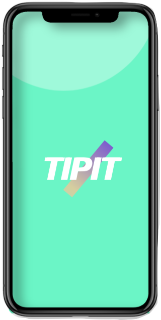

# TIPIT
<h1 align="center">
   Tipping made easy
    </h1>

    
    

  
This app lets you enter the bill total, select desired tip percentage and the total number of people splitting the bill. It's that easy!

## How It's Made:

**Tech used:** HTML, CSS, JavaScript.

I used HTML, CSS and JavaScript to create this app. The user can enter the bill amount, tip desired and number of people splitting the bill to calculate tp percentage. If the user clicks the calculate button, and any input field is left empty, an error message displays.

## Lessons Learned:

I'd never worked with Photoshop and psd files, so was able to play around more easily with images and designs.
